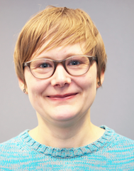

--- layout: default ---

**Contact:**

Bioinformatics group Department of Plant Sciences Wageningen University
& Research Wageningen, Netherlands

**E-mail:** anne . kupczok @ wur . nl

Research focus
--------------

**Evolutionary rate estimation**

Estimation of absolute substitution, recombination and gene turnover
rates from time series data sets.

**Phage pangenome evolution**

Contribution of different evolutionary processes to phage genome
evolution.

**Evolutionary metagenomics**

Inference of microbial evolutionary processes from genetic heterogeneity
present in metagenomes.

* * * * *

Main ongoing projects
---------------------

Population genetics of *Bathymodiolus* symbionts (with [Nicole
Dubilier](https://www.mpi-bremen.de/en/Nicole-Dubilier.html))

The casposon of *Methanosarcina mazei* Gö1 - function and evolution
(with [Ruth
Schmitz-Streit](http://www.mikrobio.uni-kiel.de/de/ag-schmitz-streit),
Finn Ole Petersen, project in priority programme [Much more than
defense: The many faces and facets of
CRISPR-Cas](https://www.uni-ulm.de/nawi/crispr-spp2141/))

Models for pangenome evolution (with [Franz
Baumdicker](http://baumdickerlab.de/))

Plasmid evolution (with [Tal
Dagan](https://www.mikrobio.uni-kiel.de/de/ag-dagan), [Hildegard
Uecker](http://web.evolbio.mpg.de/~uecker/), Mario Santer)

Evolution of lambda phages (with [Carolin
Wendling](https://usys.ethz.ch/en/people/profile.MjUyNjM3.TGlzdC82MzcsMzIwMTk3MjIy.html))

* * * * *

Short CV
--------

### 2020 - current

Assistant professor in the [Bioinformatics
group](https://www.wur.nl/en/Research-Results/Chair-groups/Plant-Sciences/Bioinformatics.htm),
[Wageningen University and Research](https://www.wur.nl/en.htm).

### 2020

Postdoctoral researcher in the group of [Nicole
Dubilier](https://www.mpi-bremen.de/en/Nicole-Dubilier.html).

### 2013 - 2020

Postdoctoral researcher in the group of [Tal
Dagan](https://www.mikrobio.uni-kiel.de/de/ag-dagan).

At Kiel University I started as a bioinformatician within the Excellence
cluster ["The future ocean"](https://www.futureocean.org/en/index.php).
Since 2015 my position was funded by the state of Schleswig-Holstein for
maintaining the [bioinformatics
network](http://www.bioinf.uni-kiel.de/en) in the Kiel area.

#### Main Publications

Godfroid M, Dagan T, Merker M, Kohl TA, Diel R, Maurer FP, Niemann S,
**Kupczok A**. 2020. Insertion and deletion evolution reflects
antibiotics selection pressure in a Mycobacterium tuberculosis outbreak.
bioRxiv:2020.01.28.922765.

Romero Picazo D, Dagan T, Ansorge R, Petersen JM, Dubilier N, **Kupczok
A**. 2019. Horizontally transmitted symbiont populations in deep-sea
mussels are genetically isolated. *ISME J.* 13:2954–2968.

Ilhan J, **Kupczok A**, Woehle C, Wein T, Hülter NF, Rosenstiel P,
Landan G, Mizrahi I, Dagan T. 2019. Segregational drift and the
interplay between plasmid copy number and evolvability. *Mol Biol Evol.*
36(3):472-486.

Godfroid M, Dagan T, **Kupczok A**. 2018. Recombination signal in
Mycobacterium tuberculosis stems from reference-guided assemblies and
alignment artefacts. *Genome Biol Evol.* 10(8):1920–1926.

**Kupczok A**, Neve H, Huang KD, Hoeppner MD, Heller KJ, Franz CMAP,
Dagan T. 2018. Rates of mutation and recombination in Siphoviridae phage
genome evolution over three decades. *Mol Biol Evol.* 35(5):1147–1159.

**Kupczok A**, Landan G, Dagan T. 2015. The contribution of genetic
recombination to CRISPR array evolution. *Genome Biol Evol.*
7(7):1925–1939.

### 2010 - 2013

Postdoctoral researcher at the [Institute of Science and Technology,
Austria (IST Austria)](https://ist.ac.at/de/home/) in the group of
Jonathan Bollback.

In Jon's group I learned to appreciate the microbial world for the study
of evolutionary processes. For example, we used phylogenetic methods to
study [the evolution of the CRISPR/Cas immune
system](https://www.ncbi.nlm.nih.gov/pubmed/23442002).

#### Main Publications

**Kupczok A**, Bollback JP. 2014. Motif depletion in bacteriophages
infecting hosts with CRISPR systems. *BMC Genomics* 15:663.

**Kupczok A**, Bollback JP. 2013. Probabilistic models for CRISPR spacer
content evolution. *BMC Evol Biol.* 13:54.

### 2006 - 2010

PhD student at the [Max Perutz Labs](https://www.maxperutzlabs.ac.at/),
Vienna, working in the Center for Integrative Bioinformatics Vienna
([CIBIV](http://www.cibiv.at/)) headed by Arndt von Haeseler.

My PhD project focused on phylogenetics, in particular on method
development for supertrees and tree distances. All the details can be
found [here](http://othes.univie.ac.at/9865/).

#### Main Publications

**Kupczok A**. 2011. Split-based computation of majority-rule
supertrees. *BMC Evol. Biol.* 11:205.

**Kupczok A**. 2011. Consequences of different null models on the tree
shape bias of supertree methods. *Syst Biol.* 60(2):218–225.

**Kupczok A**, Schmidt HA, von Haeseler A. 2010. Accuracy of phylogeny
reconstruction methods combining overlapping gene data sets. *Algorithms
Mol Biol.* 5:37.

**Kupczok A**, von Haeseler A, Klaere S. 2008. An Exact Algorithm for
the Geodesic Distance between Phylogenetic Trees. *J Comput Biol.*
15(6):577–591.

#### Software

[GeoMeTree](http://www.cibiv.at/software/geometree/) - Geodesic Metric
on Trees (another branch can be found
[here](https://github.com/kloetzl/geometree)).

[PluMiST](http://www.cibiv.at/software/plumist/) - Plus and Minus
SuperTrees.

### 2003 - 2005

Research assistant at the Friedrich Schiller University, Jena, working
in the [Biosystems Analysis Group](http://www.biosys.uni-jena.de/)
headed by Peter Dittrich.

Peter gave me the freedom to have a research project already as an
undergraduate.

#### Main Publication

**Kupczok A**, Dittrich P. 2006. Determinants of simulated RNA
evolution. *J. Theor. Biol.* 238:726–735.

### Education

2020 - Habilitation (German post-doctoral lecturing qualification), Kiel
University, Germany.

2010 - PhD in Molecular Biology, University of Vienna, Austria.

2006 - Diploma in Bioinformatics, Friedrich-Schiller-University Jena,
Germany.

* * * * *

More Information
----------------

Complete list of publications in
[pubmed](https://www.ncbi.nlm.nih.gov/pubmed/?term=Anne+Kupczok).

Profile on [Google
Scholar](https://scholar.google.de/citations?user=XEdO4FwAAAAJ&hl=en).

Profile on [ORCID](https://orcid.org/0000-0001-5237-1899).

* * * * *

[Tweets by annecmg](https://twitter.com/annecmg?ref_src=twsrc%5Etfw)
