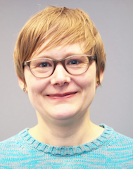

## Anne Kupczok

Assistant professor  
**Contact:** anne . kupczok @ wur . nl

{: style="float: left; margin-right: 1em;"}

I am an assistant professor in the Bioinformatics group at Wageningen University since August 2020. I am a bioinformatician by training with a particular interest how microbes and viruses evolve and how the interaction with eukaryotic hosts impact their evolution.  
In my research, I infer the diversity within microbial populations from genomes and metagenomes, where I focus on the interaction between organisms, such as phages and bacteria, and the consequences of this interaction on genome evolution. I am interested in understanding how different evolutionary processes (mutation, recombination, and horizontal gene transfer) contribute to viral and microbial evolution.

Complete list of publications in
[pubmed](https://www.ncbi.nlm.nih.gov/pubmed/?term=Anne+Kupczok).

Profile on [Google Scholar](https://scholar.google.de/citations?user=XEdO4FwAAAAJ&hl=en).

Profile on [ORCID](https://orcid.org/0000-0001-5237-1899).

[Tweets by annecmg](https://twitter.com/annecmg?ref_src=twsrc%5Etfw)

* * * * *

# PhD students

## Joliese Teunissen

> Deciphering the role of the soil microbiome in intercropping

Profile at [WUR](https://www.wur.nl/nl/Personen/Joliese-JW-Joliese-Teunissen-MSc.htm)

## Jan Baijens

> Genome evolution of plant viruses

Profile at [WUR](https://www.wur.nl/en/Persons/Jan-JHL-Jan-Baijens.htm)

## Jun Liu

co-supervision with Jing He, Energy Microbiology Center of the Chinese Academy of Agricultural Sciences

> Synthetic microbial communities for mitigating ammonia and greenhouse gases generated by fecal microbiota

# Master students

## Amanda van de Ligt

> Evolution of auxiliary metabolic genes in phages

* * * * *

# Associated members

## Nikolaos Vakirlis

Postdoc at Kiel University

> Evolution of novel genes in prokaryotes and viruses

Profile on [Google Scholar](https://scholar.google.com/citations?user=72rh-ZsAAAAJ).

[Tweets by vakirlis](https://twitter.com/vakirlis)

* * * * *

# Former Members

**Matthijs Kon**
> Master student 2021-2022

**Matthijs Pon**
> Master student 2021

**Claudia de Buck**
> Master student 2021
