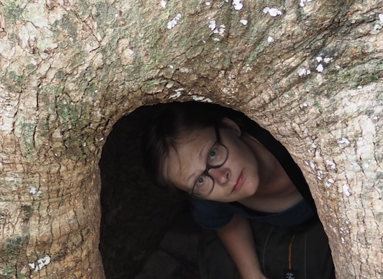

## Anne Kupczok

Assistant professor  
**Contact:** anne . kupczok @ wur . nl

{: style="float: left; margin-right: 1em;"}

I am an assistant professor in the Bioinformatics group at Wageningen University since August 2020. I am a bioinformatician by training with a particular interest how microbes and viruses evolve and how the interaction with eukaryotic hosts impact their evolution.  
In my research, I infer the diversity within microbial populations from genomes and metagenomes, where I focus on the interaction between organisms, such as phages and bacteria, and the consequences of this interaction on genome evolution. I am interested in understanding how different evolutionary processes (mutation, recombination, and horizontal gene transfer) contribute to viral and microbial evolution.

Complete list of publications in
[pubmed](https://www.ncbi.nlm.nih.gov/pubmed/?term=Anne+Kupczok).

Profile on [Google Scholar](https://scholar.google.de/citations?user=XEdO4FwAAAAJ&hl=en).

Profile on [ORCID](https://orcid.org/0000-0001-5237-1899).

Bluesky: [@annecmg@bsky.social](https://bsky.app/profile/annecmg.bsky.social)

* * * * *

# PhD students

## Joliese Teunissen

co-supervision with [Stefan Geisen](https://www.wur.nl/en/Persons/Stefan-dr.-SA-Stefan-Geisen.htm), Nematology group WUR

> Deciphering the role of the soil microbiome in intercropping

Profile at [WUR](https://www.wur.nl/nl/Personen/Joliese-JW-Joliese-Teunissen-MSc.htm)

## Dimitris Karapliafis

> Evolution of plant viruses in wild plants (in collaboration with [Mark Zwart](https://nioo.knaw.nl/nl/employees/mark-zwart))

Profile at [WUR](https://www.wur.nl/en/persons/dimitris-d-dimitris-karapliafis.htm)

## Chen Chen

co-supervision with [Dick de Ridder](https://www.wur.nl/nl/personen/dick-de-ridder-1.htm)

> Deep learning approaches for evolutionary origins of species-specific prokaryotic genes 

## Laura Patiño Medina

co-supervision with [Astrid Bryon](https://www.wur.nl/nl/personen/astrid-bryon.htm), Laboratory of Virology WUR

> Microbiome-virome interactions in whiteflies

## Thomas de Bruijn

co-supervision with [Hilje Doekes](https://www.wur.nl/nl/personen/hilje-doekes.htm), Laboratory of Genetics WUR

> Modeling diversity in bacteriophages

# Master students

## Tomer Sardjoe

> Phylogenetic and machine learning approaches for the estimation of gene co-occurrences in bacterial pangenomes

## Mate Zoltai

co-supervision with [Emilyn Matsumura](https://www.wur.nl/en/persons/emilyn-matsumura.htm), Laboratory of Virology WUR

> Small RNA-based communication in virus-vector-plant interactions

## Vural Yurt

> Prophage evolution in the Salmonella pangenome

# Bachelor students

* * * * *

# Former Members

**Jun Liu**
> Phd student 2021-2025

**Emma Nabuurs**
> Bsc thesis student 2025

**Liz Villabona Arenas**
> Msc thesis student 2024-2025

**Felipe Perez Martinez**
> Msc thesis student 2023-2024

**Inge van Vugt**
> Msc thesis student 2023-2024

**Laurens Klinkien**
> Msc thesis student 2023

**Devin van Valkengoed**
> Msc thesis student and research assistant 2022-2023

**Gian Passania**
> Msc thesis student 2023

**Joran Schoorlemmer**
> Msc thesis student 2022-2023

**Elma van Wieren**
> Msc thesis student 2022-2023

**Jori de Leuw**
> Msc thesis student 2022-2023

**Nikolai Matviiets**
> Msc thesis student 2022-2023

**Nikolaos Vakirlis**
> Associated postdoc 2021-2022

> Now at [BSRC Alexander Fleming](https://www.fleming.gr/)

**Amanda van de Ligt**
> Msc thesis student 2021-2022

**Jan Baijens**
> Research assistant 2021-2022

**Matthijs Kon**
> Msc thesis student 2021-2022

**Matthijs Pon**
> Msc thesis student 2021

**Claudia de Buck**
> Msc thesis student 2021
