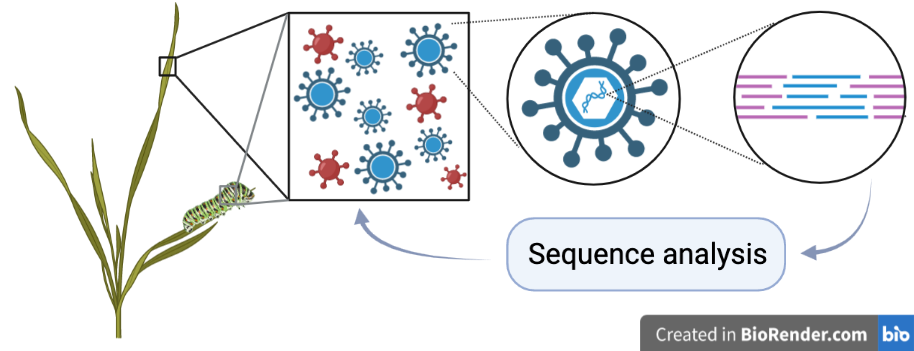
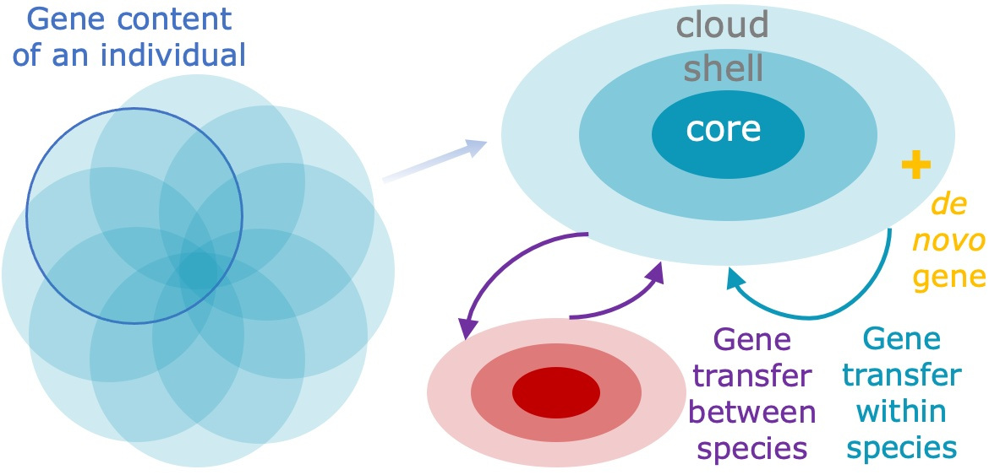
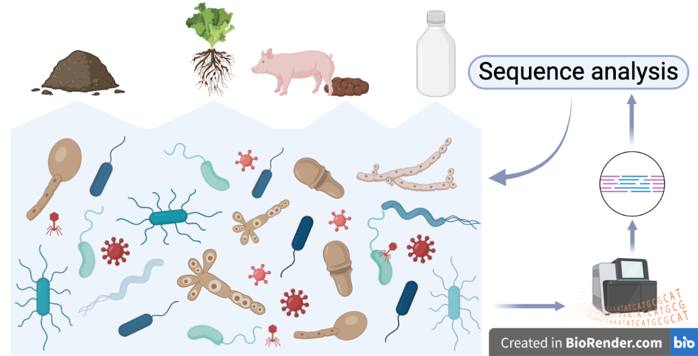

## Evolutionary metagenomics

Inference of microbial evolutionary processes from genetic heterogeneity present in metagenomes. 

### Related projects

Microdiversity in soil bacteriophages (PhD student [Thomas de Bruijn](https://www.wur.nl/nl/personen/thomas-de-bruijn-1.htm), with [Hilje Doekes](https://www.wur.nl/nl/personen/hilje-doekes.htm)).

* * * * *

## Virus discovery and evolution

Detection of viruses in plant and insect sequencing and estimation of their diversity and evolution.

### Related projects

Virus diversity and genome evolution in natural plant ecosystems (PhD student [Dimitris Karapliafis](https://www.wur.nl/en/persons/dimitris-d-dimitris-karapliafis.htm), with [Mark Zwart](https://nioo.knaw.nl/nl/employees/mark-zwart))

Virus discovery in insect genome sequencing (PhD student [Laura Patiño Medina](https://www.wur.nl/en/persons/laura-patino-medina-1.htm), with [Astrid Bryon](https://www.wur.nl/en/Persons/Astrid-dr.ir.-AEE-Astrid-Bryon.htm))

* * * * *

## Microbial and phage pangenomes

Contribution of different evolutionary processes that shape pangenomes of bacteria and phages

### Related projects

Models for pangenome evolution (with [Franz Baumdicker](http://baumdickerlab.de/))

Evolutionary origins of lineage-specific genes in prokaryotes (PhD student [Chen Chen](https://www.wur.nl/en/persons/chen-chen-2.htm), collaborations with [Nikolaos Vakirlis](https://www.linkedin.com/in/nikolaos-vakirlis-97712310b/), [Dick de Ridder](https://www.wur.nl/nl/personen/dick-de-ridder-1.htm), and [Rens Holmer](https://www.wur.nl/nl/personen/rens-holmer.htm)).

Evolution of auxiliary metabolic genes in phages and in their bacterial homologs (visiting PhD student Nina Bäuerle, in collaboration with [Nicole Frankenberg-Dinkel](https://bio.rptu.de/fgs/microbiology/team)). 

* * * * *

## Microbial communities

### Related projects

Synthetic microbial communities for mitigating ammonia and greenhouse gases generated by fecal microbiota (PhD student [Jun Liu](https://www.wur.nl/en/persons/jun-j-jun-liu.htm))

Deciphering the role of the soil microbiome in intercropping (PhD student [Joliese Teunissen](https://www.wur.nl/nl/Personen/Joliese-JW-Joliese-Teunissen-MSc.htm), with [Stefan Geisen](https://www.wur.nl/en/Persons/Stefan-dr.-SA-Stefan-Geisen.htm))

Viral communities in fermented milk products (with [Sijmen Schoustra](https://www.wur.nl/en/Persons/Sijmen-dr.ir.-SE-Sijmen-Schoustra.htm) and [Anna Alekseeva](https://www.wur.nl/nl/Personen/Anna-A-Anna-Alekseeva.htm))

* * * * *

## Additional ongoing projects

The casposon of *Methanosarcina mazei* Gö1 - function and evolution
(with [Ruth Schmitz-Streit](http://www.mikrobio.uni-kiel.de/de/ag-schmitz-streit),
Finn Ole Petersen, project in priority programme [Much more than defense: The many faces and facets of CRISPR-Cas](https://www.uni-ulm.de/nawi/crispr-spp2141/))

