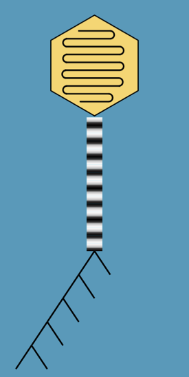

## Evolutionary metagenomics

| {: style="width: 100px;"} | Inference of microbial evolutionary processes from genetic heterogeneity present in metagenomes.  |

### Related projects

Population genetics of *Bathymodiolus* symbionts (with [Nicole Dubilier](https://www.mpi-bremen.de/en/Nicole-Dubilier.html))

* * * * *

## Virus discovery and evolution

Detection of viruses in plant and insect sequencing and estimation of their diversity and evolution.

* * * * *

## Phage pangenome evolution

Contribution of different evolutionary processes to phage genome
evolution.

### Related projects

Evolution of lambda phages (with [Carolin Wendling](https://usys.ethz.ch/en/people/profile.MjUyNjM3.TGlzdC82MzcsMzIwMTk3MjIy.html))

* * * * *

## Evolutionary rate estimation

| {: style="width: 100px;"} | Estimation of absolute substitution, recombination and gene turnover
rates from time series data sets.  |

* * * * *

## Additional ongoing projects

Models for pangenome evolution (with [Franz Baumdicker](http://baumdickerlab.de/))

The casposon of *Methanosarcina mazei* Gö1 - function and evolution
(with [Ruth Schmitz-Streit](http://www.mikrobio.uni-kiel.de/de/ag-schmitz-streit),
Finn Ole Petersen, project in priority programme [Much more than defense: The many faces and facets of CRISPR-Cas](https://www.uni-ulm.de/nawi/crispr-spp2141/))

Plasmid evolution (with [Tal Dagan](https://www.mikrobio.uni-kiel.de/de/ag-dagan), [Hildegard Uecker](http://web.evolbio.mpg.de/~uecker/), Mario Santer)
